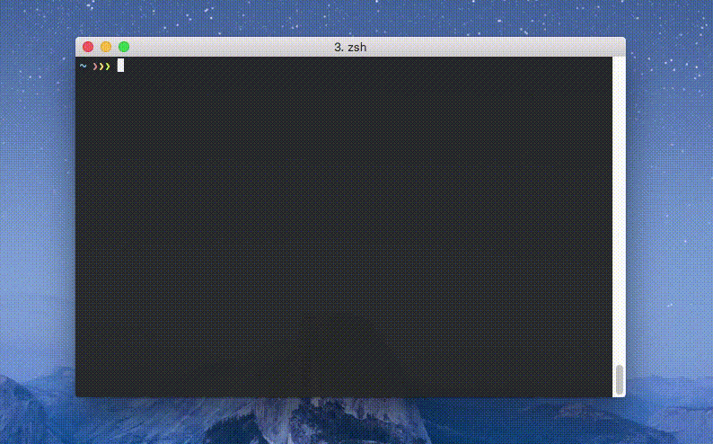

`license` is a command line tool to create LICENSE files.

It provides good defaults for name, year and project name on license (customizable if needed), and
it supports all license types listed on the [GitHub Licenses API](https://developer.github.com/v3/licenses/) and a few more. The license templates used by this program were copied from the GitHub Licenses API, when available.
```
afl-3.0       (Academic Free License)
agpl-3.0      (GNU Affero General Public License v3.0)
al-2.0        (Artistic License 2.0)
apache-2.0    (Apache License 2.0)
bsd-0-clause  (BSD Zero Clause License)
bsd-2-clause  (BSD 2-Clause "Simplified" License)
bsd-3-clause  (BSD 3-Clause "New" or "Revised" License)
bsd-4-clause  (BSD 4-clause "Original" or "Old" License)
cc-by-4.0     (CC-BY 4.0 International Public License)
cc-by-sa-4.0  (CC-BY-SA 4.0 International Public License)
cc0-1.0       (Creative Commons Zero v1.0 Universal)
ecl-2.0       (Educational Community License 2.0)
epl-2.0       (Eclipse Public License 2.0)
eupl-1.2      (European Union Public Licence 1.2)
free-art-1.3  (Free Art License 1.3)
gpl-2.0       (GNU General Public License v2.0)
gpl-3.0       (GNU General Public License v3.0)
isc           (ISC License)
lgpl-2.1      (GNU Lesser General Public License v2.1)
lgpl-3.0      (GNU Lesser General Public License v3.0)
lppl          (LaTeX Project Public License)
mit           (MIT License)
mit-0         (MIT No Attribution)
mpl-2.0       (Mozilla Public License 2.0)
ms-pl         (Microsoft Public License)
ms-rl         (Microsoft Reciprocal License)
mulanpsl-2.0  (木兰宽松许可证 第2版)
odbl-1.0      (ODC Open Database License 1.0)
ofl-1.1       (SIL OPEN FONT LICENSE Version 1.1)
osl-3.0       (Open Software License v3.0)
unlicense     (The Unlicense)
wtfpl         (Do What The Fuck You Want To Public License)
zlib          (zlib License)
```

## Install

### Building from Source

With Go 1.16 or higher:

```
go install github.com/nishanths/license/v5@latest
```

### Via the Arch User Repository (AUR)

This program is available via the AUR under the name
[`nishanths-license-git`](https://aur.archlinux.org/packages/nishanths-license-git/).
Using yay, you can install it like so:

WARNING: The authenticity of this method was last verified on 2021-07-04
by the maintainer(s) of the `license` project. Please verify before use.

```bash
yay -S nishanths-license-git
```

## Usage

#### Print license

To print a license to stdout, run the `license` command followed by the license name:

```powershell
$ license mit
```

#### Save to file

Use the `-o` flag to save the license to a file, or use your shell's redirection operator:

```powershell
$ license -o LICENSE.txt mit
$ license mit > LICENSE.txt
```

#### Customize name, year and project name

```powershell
$ license -year 2013 -name "Alice L" isc
$ license -name "Alice L" -year 2022 -project "myapp" bsd-4-clause
```

The current year is used if `-year` is omitted.

The current folder is used as the project name if `-project` is omitted.

To determine the name on the license, the following are used in this order:

```
- command line flags: -name, -n
- environment variable: LICENSE_FULL_NAME
- gitconfig and hgconfig
- "os/user".Current()
- empty string
```

If you have your name set in `$HOME/.gitconfig`, you can almost always omit the `-name` flag.

#### Demo



## Contributing

Pull requests for new features, bug fixes, and suggestions are welcome!  Please
create an issue for discussion before working on a substantial change.

## License

[MIT](https://github.com/nishanths/license/blob/master/LICENSE)
